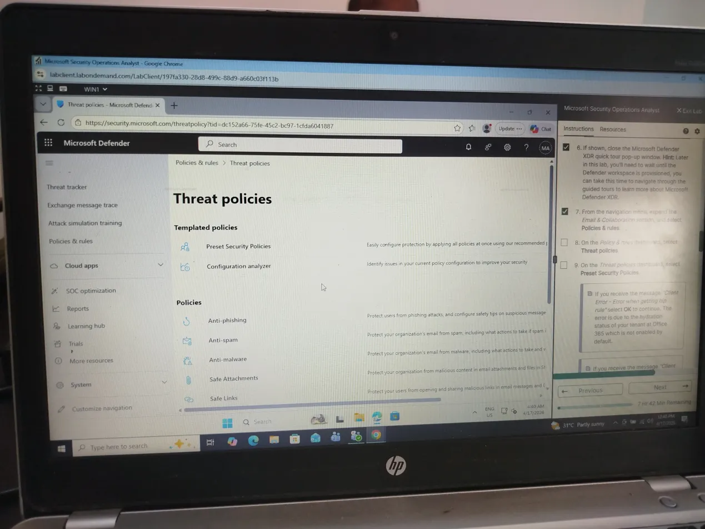
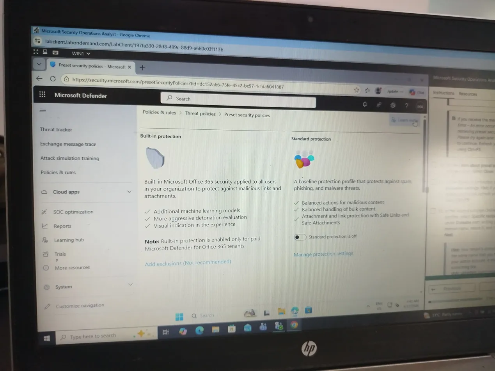
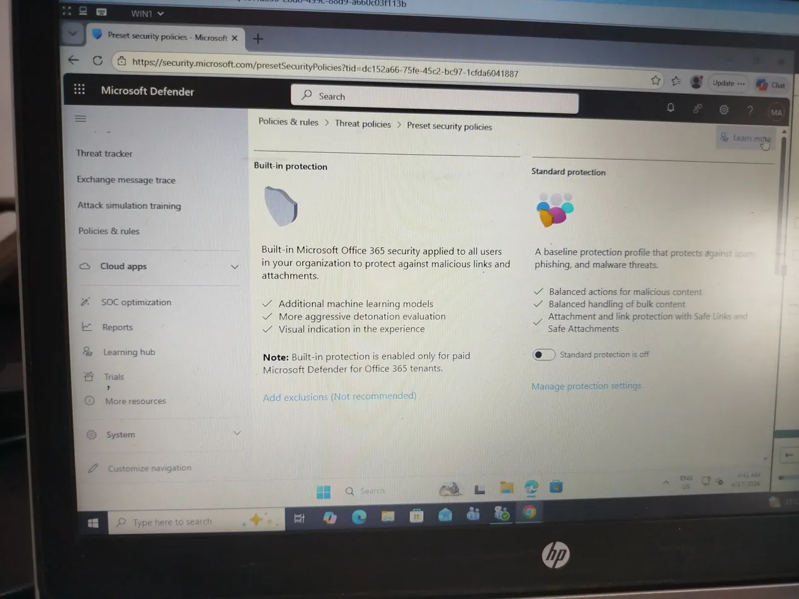
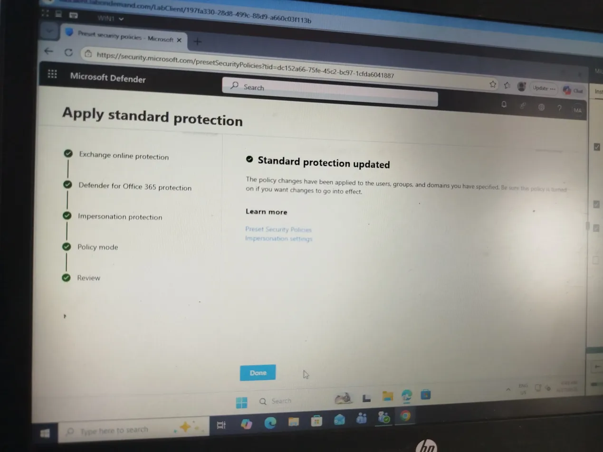
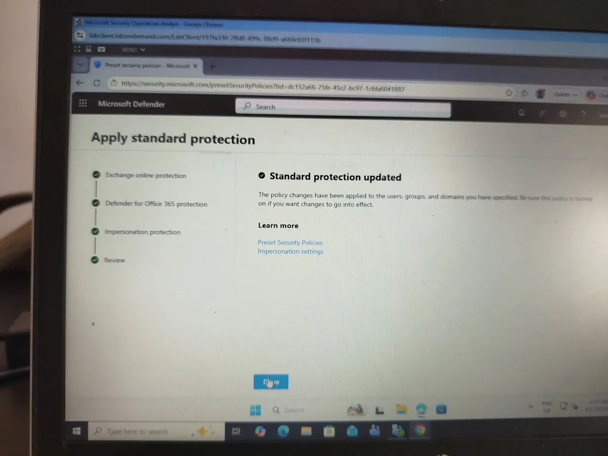
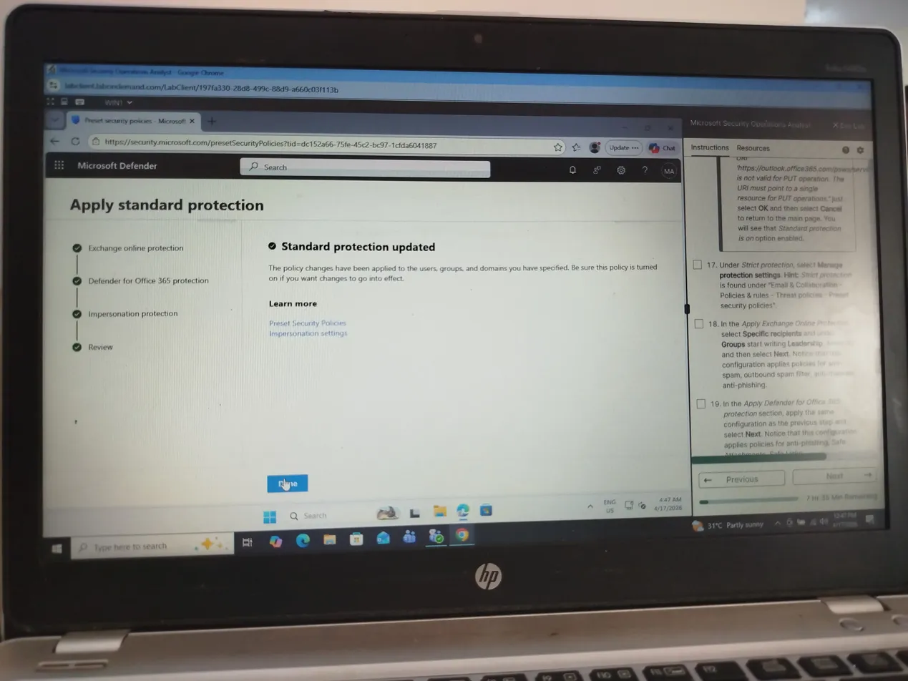

## Microsoft Security Operations Analyst — SC-200 Lab Writeup

**Platform:** Skillable (via Microsoft Learn SC-200T00-A)  
**Lab:** Microsoft Security Operations Analyst (Modules 01–04)  
**Duration:** ~8 hours  
**Completed:** January 2026  

---

## Objective

Gain hands-on experience with Microsoft Defender XDR and Microsoft Defender for Office 365 by navigating the security portal, reviewing existing threat policies, and applying preset security policies to protect an organization's environment.

---

## Tools & Platforms Used

- Microsoft Defender XDR Portal (`security.microsoft.com`)
- Microsoft Defender for Office 365
- Skillable Cloud Lab Environment (Windows VM)

---

## What I Did

### Task 1 — Explored the Microsoft Defender XDR Portal

- Signed into the Microsoft Defender XDR portal using lab-provisioned credentials
- Navigated the portal interface including the SOC optimization, Reports, and Learning hub sections
- Reviewed the guided tour of the Defender workspace to understand portal layout and navigation

### Task 2 — Reviewed Threat Policies

- Navigated to **Email & Collaboration → Policies & rules → Threat policies**
- Reviewed the following policy categories:
  - **Anti-phishing** — protects users from phishing attacks
  - **Anti-spam** — manages spam filtering actions
  - **Anti-malware** — defines actions for malware-infected emails
  - **Safe Attachments** — scans attachments for malicious content
  - **Safe Links** — rewrites and validates links in emails and Office documents
- Reviewed **Preset Security Policies** (Standard and Strict) and their built-in protection levels

### Task 3 — Applied Microsoft Defender for Office 365 Preset Security Policies

Configured and applied **Standard Protection** policy:
- Exchange Online Protection (EOP) — anti-spam, anti-phishing, anti-malware
- Defender for Office 365 protection — Safe Attachments, Safe Links
- Impersonation protection settings
- Assigned policy to specific user groups (Leadership)
- Confirmed: **Standard protection updated** ✅

Configured and applied **Strict Protection** policy:
- Applied same configuration steps as Standard but with stricter enforcement
- Confirmed: **Strict protection updated** ✅

---

## Key Takeaways

- Understood the difference between **Standard** and **Strict** preset security policies and when each is appropriate
- Learned how Exchange Online Protection and Defender for Office 365 work together to provide layered email security
- Practiced applying security policies to specific user groups rather than the entire organization
- Observed how impersonation protection helps defend against business email compromise (BEC) attacks

---

## Screenshots

| # | Lab | Status |
|---|-----|--------|
| 1 | Microsoft Security Operations Analyst (Modules 01–04) | ✅ Complete |
| 2 | Mitigate threats using Microsoft Defender for Cloud | ✅ Complete |
| 3 | Create queries using KQL in Microsoft Sentinel | ✅ Complete |
| 4 | Configure Microsoft Sentinel environment | ✅ Complete |
| 5 | Connect logs to Microsoft Sentinel | ✅ Complete |
| 6 | Create detections and perform investigations in Sentinel | ✅ Complete |
| 7 | Perform threat hunting in Microsoft Sentinel | ⬜ In progress |

---

*Part of SC-200T00-A: Defend against cyberthreats with Microsoft's security operations platform* SC-200-sentinel-labs
SC 200 hands on lab writeup using Microsoft sentinel and Defender
